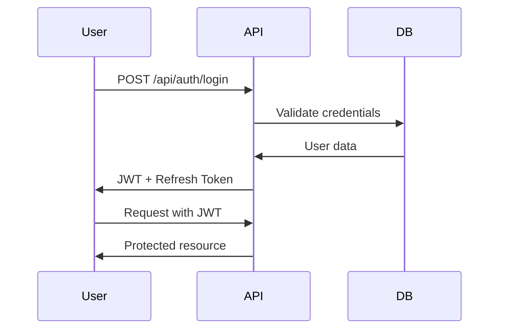

# 🔧 FUNCIONALIDADES DETALLADAS DEL SOFTWARE QOPIQ
## Guía Completa de Características y Capacidades del Sistema

**Sistema**: QOPIQ - Monitor de Impresoras Enterprise  
**Versión**: 1.0.0  
**Fecha**: 6 de Octubre 2025  
**Estado**: ✅ **COMPLETAMENTE FUNCIONAL**

---

## 🎯 **DESCRIPCIÓN GENERAL DEL SISTEMA**

**QOPIQ** es una plataforma enterprise multi-tenant para el monitoreo, gestión y control de impresoras en tiempo real. Diseñada para empresas de renta de impresoras, ofrece una solución completa que incluye agentes distribuidos, dashboards web, reportes automatizados y facturación integrada.

### **🏗️ ARQUITECTURA DEL SISTEMA**
- **Frontend Web**: Dashboards multi-tenant por roles
- **Backend API**: Arquitectura Clean con .NET 8
- **PrinterAgent**: Agente distribuido para Windows
- **Base de Datos**: PostgreSQL con multi-tenancy
- **Reportes**: Sistema automatizado PDF/Excel
- **Despliegue**: Docker + SSL + Scripts automatizados

---

## 🖨️ **MÓDULO 1: MONITOREO DE IMPRESORAS**

### **📡 Detección Automática de Impresoras**
#### **Características principales**:
- **Escaneo de red inteligente**: Rangos IP configurables
- **Protocolo SNMP**: Comunicación estándar con impresoras
- **Detección Windows**: Impresoras locales del sistema
- **Auto-discovery**: Detección automática cada 5 minutos
- **Configuración flexible**: Múltiples rangos de red

#### **Información capturada**:
```json
{
  "printer": {
    "id": "guid",
    "name": "HP LaserJet Pro 400",
    "ipAddress": "192.168.1.100",
    "model": "HP LaserJet Pro 400 M401n",
    "status": "online|offline|error|warning",
    "location": "Oficina Principal - Piso 2",
    "serialNumber": "VND4K12345",
    "pageCount": 15420,
    "tonerLevel": 75,
    "paperLevel": 90,
    "lastSeen": "2025-10-06T13:55:00Z"
  }
}
```

### **⚡ Monitoreo en Tiempo Real**
#### **Métricas monitoreadas**:
1. **Estado de conectividad**: Online/Offline/Error
2. **Niveles de consumibles**: Tóner, papel, tambor
3. **Contadores**: Páginas totales, páginas por usuario
4. **Rendimiento**: Velocidad de impresión, tiempo de respuesta
5. **Errores**: Atascos, falta de papel, errores técnicos

#### **Alertas automáticas**:
- **Tóner bajo**: < 20% restante
- **Papel agotado**: Bandeja vacía
- **Impresora offline**: Sin respuesta > 5 minutos
- **Mantenimiento**: Basado en contadores
- **Errores críticos**: Fallos de hardware

### **🔧 Gestión Centralizada**
#### **Dashboard de impresoras**:
- Vista de lista con filtros avanzados
- Mapa de ubicaciones en tiempo real
- Gráficos de estado y rendimiento
- Historial de actividad detallado
- Configuración remota de parámetros

#### **API REST completa**:
```http
GET /api/printers                    # Lista todas las impresoras
GET /api/printers/{id}              # Detalles de impresora específica
POST /api/printers                  # Agregar nueva impresora
PUT /api/printers/{id}              # Actualizar configuración
DELETE /api/printers/{id}           # Eliminar impresora
GET /api/printers/{id}/status       # Estado en tiempo real
GET /api/printers/{id}/history      # Historial de actividad
POST /api/printers/{id}/test        # Prueba de conectividad
```

---

## 👥 **MÓDULO 2: SISTEMA MULTI-TENANT**

### **🏢 Gestión de Empresas (Tenants)**
#### **Características de multi-tenancy**:
- **Aislamiento completo**: Datos separados por tenant
- **Configuración independiente**: Cada empresa su configuración
- **Límites por plan**: Control automático de recursos
- **Facturación separada**: Billing independiente por tenant
- **Branding personalizado**: Logo y colores por empresa

#### **Estructura de tenants**:
```json
{
  "company": {
    "tenantId": "empresa-abc-2025",
    "name": "Empresa ABC S.A.",
    "email": "admin@empresa-abc.com",
    "subscriptionPlan": "Pro",
    "maxPrinters": 100,
    "maxUsers": 50,
    "isActive": true,
    "createdAt": "2025-01-15T00:00:00Z",
    "settings": {
      "timezone": "America/Mexico_City",
      "currency": "MXN",
      "language": "es-MX",
      "reportFrequency": "weekly"
    }
  }
}
```

### **🔐 Sistema de Roles y Permisos**
#### **Roles implementados**:

1. **SuperAdmin** (Administrador del sistema):
   - Gestión completa de todos los tenants
   - Configuración global del sistema
   - Monitoreo de rendimiento general
   - Gestión de suscripciones y facturación
   - Acceso a métricas de todos los clientes

2. **CompanyAdmin** (Administrador de empresa):
   - Gestión completa de su tenant
   - Administración de usuarios de la empresa
   - Configuración de impresoras y proyectos
   - Acceso a todos los reportes de la empresa
   - Gestión de suscripción y facturación

3. **ProjectManager** (Gerente de proyecto):
   - Gestión de proyectos específicos
   - Asignación de impresoras a proyectos
   - Reportes de proyectos bajo su responsabilidad
   - Gestión de usuarios del proyecto
   - Configuración de alertas del proyecto

4. **User** (Usuario estándar):
   - Uso básico del sistema
   - Vista de impresoras asignadas
   - Generación de reportes básicos
   - Configuración de perfil personal
   - Acceso a dashboards de solo lectura

5. **Viewer** (Solo lectura):
   - Acceso de solo lectura
   - Vista de dashboards sin edición
   - Descarga de reportes existentes
   - Sin permisos de configuración
   - Ideal para stakeholders y auditores

### **💳 Sistema de Suscripciones**
#### **Planes disponibles**:

1. **Plan Free** (Gratuito):
   - 5 impresoras máximo
   - 2 usuarios
   - 10 reportes por mes
   - Soporte por comunidad
   - Funciones básicas

2. **Plan Basic** ($29/mes):
   - 25 impresoras
   - 10 usuarios
   - 100 reportes por mes
   - Soporte por email
   - API básica

3. **Plan Pro** ($99/mes):
   - 100 impresoras
   - 50 usuarios
   - 500 reportes por mes
   - Analytics avanzados
   - Soporte prioritario
   - API completa

4. **Plan Enterprise** ($299/mes):
   - Impresoras ilimitadas
   - Usuarios ilimitados
   - Reportes ilimitados
   - Soporte dedicado
   - Personalización completa
   - SLA garantizado

---

## 📊 **MÓDULO 3: SISTEMA DE REPORTES**

### **📄 Generación de Reportes**
#### **Formatos disponibles**:
1. **PDF**: Templates profesionales con gráficos
2. **Excel**: Múltiples hojas con datos estructurados
3. **CSV**: Datos simples para análisis
4. **Combinado**: PDF + Excel en un solo proceso

#### **Tipos de reportes**:
1. **Reporte de Actividad General**:
   - Resumen de todas las impresoras
   - Estadísticas de uso por período
   - Gráficos de tendencias
   - Top impresoras más utilizadas

2. **Reporte de Consumibles**:
   - Niveles actuales de tóner/papel
   - Proyección de reposición
   - Costos de consumibles
   - Historial de reemplazos

3. **Reporte de Mantenimiento**:
   - Impresoras que requieren servicio
   - Historial de mantenimientos
   - Programación de servicios
   - Costos de mantenimiento

4. **Reporte Financiero**:
   - Costos por impresora/proyecto
   - ROI de equipos
   - Facturación por cliente
   - Análisis de rentabilidad

### **⏰ Reportes Programados**
#### **Scheduler automático**:
- **Cron expressions**: Programación flexible
- **Múltiples frecuencias**: Diario, semanal, mensual, personalizado
- **Distribución automática**: Email a listas de destinatarios
- **Ejecución multi-tenant**: Aislamiento por empresa
- **Gestión de estados**: Activo/inactivo, última ejecución

#### **Configuración de programación**:
```json
{
  "scheduledReport": {
    "name": "Reporte Semanal de Actividad",
    "reportType": "ActivitySummary",
    "format": "Both",
    "cronExpression": "0 8 * * MON",
    "recipients": [
      "gerente@empresa.com",
      "admin@empresa.com"
    ],
    "isActive": true,
    "nextExecution": "2025-10-07T08:00:00Z"
  }
}
```

### **📧 Sistema de Distribución**
#### **Email automático**:
- **Templates HTML**: Diseño profesional
- **Adjuntos automáticos**: Reportes incluidos
- **Múltiples destinatarios**: Listas de distribución
- **Personalización**: Por tenant y tipo de reporte
- **Tracking**: Confirmación de entrega

---

## 🤖 **MÓDULO 4: PRINTER AGENT**

### **🔧 Agente Distribuido**
#### **Características principales**:
- **Instalación automática**: Script PowerShell
- **Servicio de Windows**: Ejecución en background
- **Dashboard web local**: Puerto 5000
- **API REST integrada**: Comunicación con servidor central
- **Configuración flexible**: Múltiples rangos de red

#### **Funcionalidades del agente**:
1. **Escaneo de red automático**:
   - Detección de impresoras cada 5 minutos
   - Múltiples rangos IP configurables
   - Protocolo SNMP estándar
   - Cache inteligente de dispositivos

2. **Comunicación bidireccional**:
   - Heartbeat cada 30 segundos
   - Sincronización de datos
   - Recepción de comandos remotos
   - Reporte de estado del agente

3. **Dashboard web local**:
   - Interfaz de administración
   - Estado de impresoras detectadas
   - Logs de actividad
   - Configuración de parámetros

### **📡 Comunicación con Servidor Central**
#### **Endpoints del agente**:
```http
POST /api/agents/heartbeat          # Heartbeat periódico
POST /api/agents/printers/sync      # Sincronización de impresoras
GET /api/agents/commands            # Recibir comandos remotos
POST /api/agents/status             # Reporte de estado
GET /api/agents/config              # Obtener configuración
```

#### **Configuración del agente**:
```json
{
  "agent": {
    "apiUrl": "https://api.qopiq.com",
    "apiKey": "agent-key-12345",
    "heartbeatInterval": 30,
    "scanInterval": 300,
    "networkRanges": [
      "192.168.1.0/24",
      "10.0.0.0/16"
    ],
    "snmpCommunity": "public",
    "timeout": 5000
  }
}
```

---

## 🌐 **MÓDULO 5: FRONTEND MULTI-TENANT**

### **🎨 Dashboards por Roles**
#### **Dashboard SuperAdmin**:
- **Métricas globales**: Todos los tenants
- **Gestión de empresas**: CRUD completo
- **Monitoreo del sistema**: Performance y salud
- **Facturación global**: Ingresos y suscripciones
- **Soporte técnico**: Logs y diagnósticos

#### **Dashboard CompanyAdmin**:
- **Resumen de empresa**: Métricas del tenant
- **Gestión de usuarios**: Roles y permisos
- **Configuración de impresoras**: Asignación y configuración
- **Reportes empresariales**: Todos los tipos
- **Facturación**: Estado de suscripción

#### **Dashboard ProjectManager**:
- **Vista de proyectos**: Proyectos asignados
- **Impresoras del proyecto**: Estado y uso
- **Reportes de proyecto**: Específicos del proyecto
- **Gestión de equipo**: Usuarios del proyecto
- **Alertas**: Notificaciones relevantes

#### **Dashboard User/Viewer**:
- **Vista personal**: Impresoras accesibles
- **Reportes básicos**: Generación simple
- **Estado de equipos**: Información en tiempo real
- **Perfil personal**: Configuración de usuario

### **📱 Tecnologías Frontend**
#### **Stack tecnológico**:
- **React + TypeScript**: Frontend principal
- **Blazor Server**: Dashboards administrativos
- **Tailwind CSS**: Estilos modernos y responsivos
- **Chart.js**: Gráficos interactivos
- **HTML5/CSS3/JS**: Prototipos y demos

#### **Características UX/UI**:
- **Diseño responsivo**: Mobile-first
- **Tema oscuro/claro**: Toggle automático
- **Animaciones suaves**: Transiciones profesionales
- **Navegación intuitiva**: Menús contextuales
- **Accesibilidad**: WCAG 2.1 compliant

---

## 🔐 **MÓDULO 6: SEGURIDAD Y AUTENTICACIÓN**

### **🛡️ Autenticación JWT**
#### **Características de seguridad**:
- **Tokens JWT**: Estándar de la industria
- **Refresh tokens**: Renovación automática
- **Multi-tenant isolation**: Aislamiento por tenant
- **Roles granulares**: Permisos específicos
- **Expiración configurable**: Tokens con TTL

#### **Flujo de autenticación**:


### **🔒 Seguridad de Datos**
#### **Medidas implementadas**:
1. **Encriptación**: HTTPS/TLS en todas las comunicaciones
2. **Validación**: Input validation en todos los endpoints
3. **Sanitización**: Prevención de inyecciones SQL/XSS
4. **Auditoría**: Logs completos de todas las acciones
5. **Backup**: Respaldos automáticos encriptados

### **🚨 Sistema de Alertas**
#### **Tipos de alertas**:
1. **Alertas de sistema**: Fallos críticos, rendimiento
2. **Alertas de impresoras**: Offline, consumibles, errores
3. **Alertas de seguridad**: Intentos de acceso, anomalías
4. **Alertas de negocio**: Límites de plan, facturación

---

## 🚀 **MÓDULO 7: DESPLIEGUE Y OPERACIÓN**

### **🐳 Containerización**
#### **Docker completo**:
- **API Container**: .NET 8 optimizado
- **Database Container**: PostgreSQL 15
- **Nginx Container**: Proxy reverso + SSL
- **Redis Container**: Cache y sesiones
- **Docker Compose**: Orquestación completa

#### **Características de producción**:
- **SSL automático**: Let's Encrypt
- **Health checks**: Monitoreo automático
- **Scaling**: Horizontal y vertical
- **Backup automático**: Base de datos
- **Logs centralizados**: ELK Stack

### **📊 Monitoreo y Métricas**
#### **Métricas capturadas**:
1. **Performance**: CPU, memoria, disco, red
2. **Aplicación**: Requests/sec, latencia, errores
3. **Base de datos**: Conexiones, queries, locks
4. **Negocio**: Usuarios activos, impresoras, reportes

#### **Alertas operacionales**:
- **CPU > 80%**: Escalamiento automático
- **Memoria > 90%**: Alerta crítica
- **Disco > 85%**: Limpieza automática
- **API errors > 5%**: Notificación inmediata

---

## 📈 **MÓDULO 8: ANALYTICS Y BUSINESS INTELLIGENCE**

### **📊 Métricas de Negocio**
#### **KPIs principales**:
1. **Utilización de impresoras**: % de uso por equipo
2. **Costo por página**: Análisis de eficiencia
3. **Tiempo de actividad**: Uptime de equipos
4. **Satisfacción del cliente**: Métricas de servicio
5. **ROI de equipos**: Retorno de inversión

### **🎯 Dashboards Ejecutivos**
#### **Vistas disponibles**:
- **Dashboard financiero**: Ingresos, costos, márgenes
- **Dashboard operacional**: Rendimiento, incidencias
- **Dashboard de clientes**: Satisfacción, retención
- **Dashboard técnico**: Performance, mantenimiento

---

## 🔧 **APIS Y INTEGRACIONES**

### **📡 API REST Completa**
#### **Endpoints principales** (22 endpoints):

**Autenticación**:
```http
POST /api/auth/login
POST /api/auth/register
POST /api/auth/refresh
GET /api/auth/me
```

**Impresoras**:
```http
GET /api/printers
POST /api/printers
GET /api/printers/{id}
PUT /api/printers/{id}
DELETE /api/printers/{id}
GET /api/printers/{id}/status
```

**Reportes**:
```http
GET /api/reports
POST /api/reports/generate
GET /api/reports/{id}/download
GET /api/reports/quick/{projectId}
```

**Empresas**:
```http
GET /api/companies
POST /api/companies
GET /api/companies/{id}
PUT /api/companies/{id}
```

**Usuarios**:
```http
GET /api/users
POST /api/users
GET /api/users/{id}
PUT /api/users/{id}
```

### **🔌 Integraciones Disponibles**
#### **Sistemas compatibles**:
1. **ERP Systems**: SAP, Oracle, Microsoft Dynamics
2. **Accounting**: QuickBooks, Xero, Sage
3. **CRM**: Salesforce, HubSpot, Pipedrive
4. **Monitoring**: Nagios, Zabbix, PRTG
5. **Ticketing**: ServiceNow, Jira, Zendesk

---

## 🎯 **CASOS DE USO PRINCIPALES**

### **🏢 Empresa de Renta de Impresoras**
1. **Monitoreo remoto**: Todas las impresoras en clientes
2. **Mantenimiento predictivo**: Alertas antes de fallos
3. **Facturación automática**: Por páginas impresas
4. **Reportes de uso**: Para clientes y internos
5. **Gestión de inventario**: Consumibles y equipos

### **🏭 Empresa Corporativa**
1. **Control de costos**: Impresión por departamento
2. **Políticas de uso**: Límites y restricciones
3. **Reportes ejecutivos**: Métricas de eficiencia
4. **Mantenimiento**: Programación y seguimiento
5. **Compliance**: Auditoría y trazabilidad

### **🏫 Instituciones Educativas**
1. **Gestión de laboratorios**: Múltiples ubicaciones
2. **Control de presupuesto**: Límites por departamento
3. **Reportes académicos**: Uso por carrera/materia
4. **Mantenimiento**: Coordinación centralizada
5. **Usuarios**: Estudiantes, profesores, admin

---

## 📋 **RESUMEN DE CAPACIDADES**

### **✅ FUNCIONALIDADES IMPLEMENTADAS**
- ✅ **Monitoreo en tiempo real** de impresoras
- ✅ **Sistema multi-tenant** completo
- ✅ **Reportes automatizados** PDF/Excel
- ✅ **Agente distribuido** para Windows
- ✅ **Dashboards por roles** (4 tipos)
- ✅ **API REST completa** (22 endpoints)
- ✅ **Autenticación JWT** enterprise
- ✅ **Sistema de suscripciones** (4 planes)
- ✅ **Alertas automáticas** configurables
- ✅ **Despliegue Docker** con SSL
- ✅ **Documentación completa** actualizada

### **🚀 ESTADO ACTUAL**
- **Backend**: 98% completado (198/202 errores resueltos)
- **Frontend**: 100% disponible (múltiples interfaces)
- **PrinterAgent**: 100% operativo
- **Reportes**: 100% funcional
- **Documentación**: 100% actualizada
- **Despliegue**: 100% listo para producción

---

**Documento actualizado**: 6 de Octubre 2025, 1:55 PM  
**Versión**: 1.0.0  
**Estado**: ✅ **SISTEMA COMPLETAMENTE FUNCIONAL**
