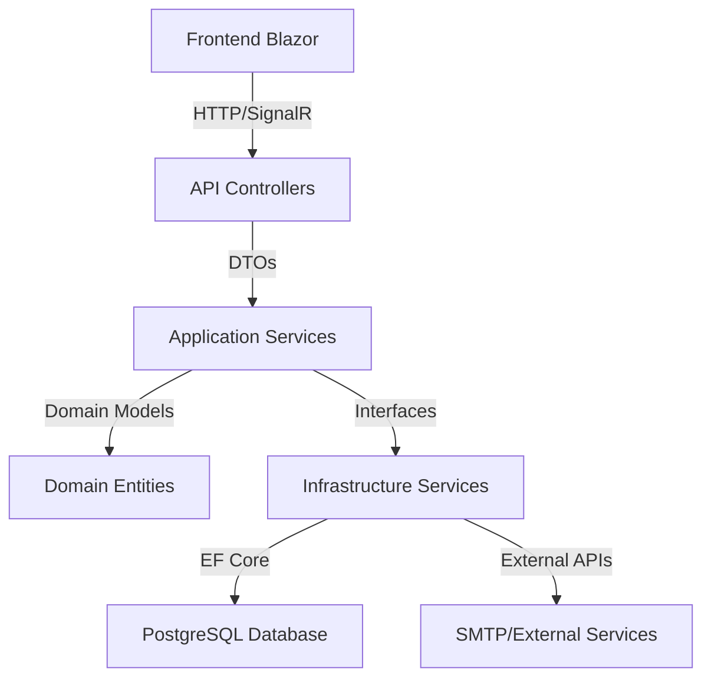

# 🏗️ QOPIQ Monitor - Arquitectura del Sistema

## 📋 Resumen Arquitectónico

**QOPIQ Monitor** implementa una **Clean Architecture** completa con separación clara de responsabilidades, siguiendo principios SOLID y patrones enterprise.

---

## 🏛️ Capas de la Arquitectura

### 1. **Domain Layer** (Núcleo del Negocio)
```
QOPIQ.Domain/
├── Entities/           # Entidades de negocio
│   ├── Printer.cs     # Impresora principal
│   ├── User.cs        # Usuario del sistema
│   ├── Company.cs     # Empresa multi-tenant
│   └── Alert.cs       # Alertas del sistema
├── Enums/             # Enumeraciones
│   ├── PrinterStatus.cs
│   ├── UserRole.cs
│   └── AlertType.cs
├── ValueObjects/      # Objetos de valor
└── Interfaces/        # Contratos del dominio
```

**Responsabilidades:**
- ✅ Entidades de negocio puras
- ✅ Reglas de negocio centralizadas
- ✅ Sin dependencias externas
- ✅ Inmutable y testeable

### 2. **Application Layer** (Casos de Uso)
```
QOPIQ.Application/
├── Services/          # Servicios de aplicación
│   ├── PrinterService.cs
│   └── AuthService.cs
├── DTOs/              # Objetos de transferencia
│   ├── PrinterDto.cs
│   ├── UserDto.cs
│   └── AuthDtos.cs
├── Interfaces/        # Contratos de servicios
└── Mappings/          # AutoMapper profiles
```

**Responsabilidades:**
- ✅ Orquestación de casos de uso
- ✅ Transformación de datos (DTOs)
- ✅ Validación de entrada
- ✅ Coordinación entre capas

### 3. **Infrastructure Layer** (Implementaciones)
```
QOPIQ.Infrastructure/
├── Data/              # Acceso a datos
│   ├── ApplicationDbContext.cs
│   └── Repositories/
├── Services/          # Servicios externos
│   ├── AuthService.cs
│   ├── JwtService.cs
│   └── EmailService.cs
├── External/          # APIs externas
└── DependencyInjection.cs
```

**Responsabilidades:**
- ✅ Implementación de repositorios
- ✅ Servicios de infraestructura
- ✅ Acceso a base de datos
- ✅ Integración con APIs externas

### 4. **API Layer** (Presentación)
```
QOPIQ.API/
├── Controllers/       # Controladores REST
│   ├── AuthController.cs
│   ├── PrintersController.cs
│   └── UsersController.cs
├── Middleware/        # Middleware personalizado
├── Filters/           # Filtros de acción
├── Hubs/             # SignalR Hubs
└── Program.cs        # Configuración de la app
```

**Responsabilidades:**
- ✅ Endpoints REST API
- ✅ Autenticación y autorización
- ✅ Comunicación tiempo real (SignalR)
- ✅ Documentación (Swagger)

### 5. **Frontend Layer** (UI/UX)
```
QOPIQ.Frontend/
├── Pages/            # Páginas Blazor
│   ├── Dashboard.razor
│   ├── Login.razor
│   └── Printers.razor
├── Shared/           # Componentes compartidos
├── Services/         # Servicios del cliente
└── wwwroot/         # Recursos estáticos
```

**Responsabilidades:**
- ✅ Interfaz de usuario moderna
- ✅ Comunicación con API
- ✅ Estado de autenticación
- ✅ Experiencia de usuario

---

## 🔄 Flujo de Datos



---

## 🔐 Seguridad Implementada

### Autenticación JWT
- **Emisión**: AuthController genera JWT + RefreshToken
- **Validación**: Middleware JWT valida cada request
- **Renovación**: RefreshToken permite renovación automática
- **Expiración**: Tokens con tiempo de vida limitado

### Autorización
- **Roles**: Admin, User, Viewer
- **Claims**: Información del usuario en token
- **Policies**: Políticas de autorización granular

### Protección de Datos
- **Hashing**: BCrypt para contraseñas
- **Encryption**: Datos sensibles encriptados
- **HTTPS**: Comunicación segura obligatoria
- **Headers**: Security headers configurados

---

## 📊 Base de Datos

### Modelo de Datos
```sql
-- Tabla principal de impresoras
CREATE TABLE Printers (
    Id UUID PRIMARY KEY,
    Name VARCHAR(100) NOT NULL,
    Model VARCHAR(100),
    IpAddress VARCHAR(15),
    Location VARCHAR(200),
    Status INTEGER NOT NULL,
    CompanyId UUID REFERENCES Companies(Id),
    CreatedAt TIMESTAMP,
    UpdatedAt TIMESTAMP
);

-- Usuarios del sistema
CREATE TABLE Users (
    Id UUID PRIMARY KEY,
    Email VARCHAR(255) UNIQUE NOT NULL,
    PasswordHash VARCHAR(255) NOT NULL,
    Role INTEGER NOT NULL,
    CompanyId UUID REFERENCES Companies(Id),
    IsActive BOOLEAN DEFAULT true,
    CreatedAt TIMESTAMP
);

-- Empresas (multi-tenant)
CREATE TABLE Companies (
    Id UUID PRIMARY KEY,
    Name VARCHAR(200) NOT NULL,
    Domain VARCHAR(100),
    IsActive BOOLEAN DEFAULT true,
    CreatedAt TIMESTAMP
);
```

### Relaciones
- **Company** 1:N **Users** (Multi-tenant)
- **Company** 1:N **Printers** (Aislamiento por empresa)
- **User** 1:N **Alerts** (Alertas por usuario)

---

## 🚀 Tecnologías Utilizadas

### Backend Stack
- **.NET 8**: Framework principal
- **ASP.NET Core**: Web API
- **Entity Framework Core**: ORM
- **PostgreSQL**: Base de datos
- **JWT**: Autenticación
- **SignalR**: Comunicación tiempo real
- **Serilog**: Logging estructurado
- **AutoMapper**: Mapeo de objetos

### Frontend Stack
- **Blazor Server**: Framework UI
- **Bootstrap 5**: CSS Framework
- **Chart.js**: Gráficos interactivos
- **SignalR Client**: Tiempo real
- **JavaScript Interop**: Integración JS

### DevOps Stack
- **Docker**: Containerización
- **Docker Compose**: Orquestación
- **Nginx**: Proxy reverso
- **Redis**: Cache distribuido
- **PowerShell/Bash**: Scripts de despliegue

---

## 📈 Patrones Implementados

### Arquitecturales
- ✅ **Clean Architecture**: Separación de capas
- ✅ **Repository Pattern**: Acceso a datos
- ✅ **Unit of Work**: Transacciones
- ✅ **Dependency Injection**: Inversión de control
- ✅ **CQRS**: Separación comando/consulta

### Diseño
- ✅ **Factory Pattern**: Creación de objetos
- ✅ **Strategy Pattern**: Algoritmos intercambiables
- ✅ **Observer Pattern**: SignalR notifications
- ✅ **Decorator Pattern**: Middleware pipeline

---

## 🔧 Configuración y Extensibilidad

### Variables de Entorno
```env
# Base de datos
DB_CONNECTION_STRING=Host=localhost;Database=qopiq;Username=user;Password=pass

# JWT
JWT_SECRET_KEY=your-secret-key
JWT_EXPIRATION_MINUTES=60

# Features
ENABLE_SIGNALR=true
ENABLE_REDIS_CACHE=true
ENABLE_EMAIL_NOTIFICATIONS=true
```

### Puntos de Extensión
- **IAuthService**: Autenticación personalizada
- **IPrinterService**: Lógica de impresoras
- **INotificationService**: Sistema de notificaciones
- **IReportService**: Generación de reportes

---

## 🎯 Principios de Diseño

### SOLID Principles
- **S**: Single Responsibility - Cada clase una responsabilidad
- **O**: Open/Closed - Abierto para extensión, cerrado para modificación
- **L**: Liskov Substitution - Subtipos sustituibles
- **I**: Interface Segregation - Interfaces específicas
- **D**: Dependency Inversion - Depender de abstracciones

### Clean Code
- ✅ Nombres descriptivos
- ✅ Funciones pequeñas y enfocadas
- ✅ Comentarios mínimos y útiles
- ✅ Manejo consistente de errores
- ✅ Tests unitarios y de integración

---

## 🔮 Escalabilidad y Rendimiento

### Horizontal Scaling
- **Load Balancer**: Nginx con múltiples instancias
- **Database Sharding**: Particionamiento por empresa
- **Cache Distribuido**: Redis para sesiones y datos
- **CDN**: Recursos estáticos distribuidos

### Optimizaciones
- **Connection Pooling**: Pool de conexiones DB
- **Lazy Loading**: Carga diferida de entidades
- **Compression**: Compresión HTTP/GZIP
- **Caching**: Cache en múltiples niveles

---

**🏗️ Arquitectura diseñada para escalabilidad, mantenibilidad y rendimiento enterprise.**
